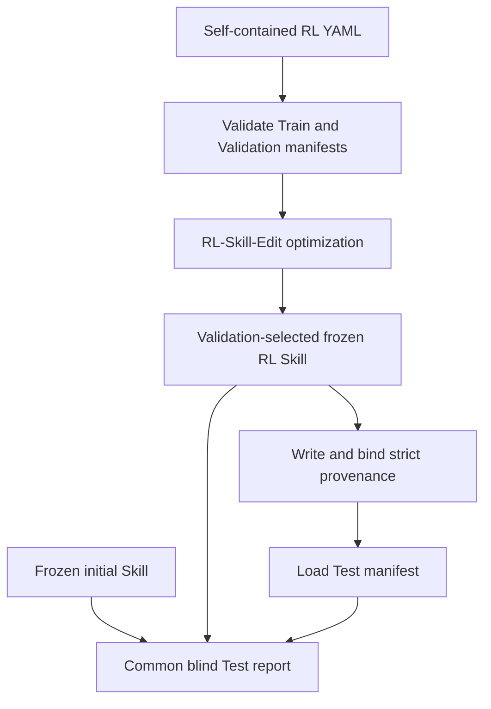

# Architecture

## Single RL workflow

`initial_skill` is an input and paired reporting baseline. The repository exposes
only one optimization method: `rl_skill_edit`.

## Main modules

| File | Responsibility |
| --- | --- |
| `rl_skill_edit/cli.py` | Strict config validation, one fixed train/test-only workflow, provenance, transactional freeze, and reporting composition |
| `rl_skill_edit/optimizer.py` | Train-only policy updates, Validation checkpoint selection, and bundle-relative artifact records |
| `rl_skill_edit/evaluation.py` | Deterministic mock evaluation and forced-skill Spreadsheet evaluation |
| `rl_skill_edit/adapters/openrouter.py` | Student and Editor chat calls with explicit token and cost accounting |
| `rl_skill_edit/adapters/spreadsheet.py` | Forced-skill Spreadsheet execution and exact workbook scoring |
| `rl_skill_edit/reporting.py` | Paired blind Test report for initial Skill and frozen RL Skill only |
| `rl_skill_edit/manifest.py` | Exact split sizes, file/content digests, unique IDs, and overlap rejection |
| `rl_skill_edit/budget.py` | Atomic Student, Editor, Evaluator, token, cache, and wall-time reservations |

## Execution rules

1. The CLI accepts only `--config`, `--seed`, and `--test-only`.
2. Training loads Train and Validation first, optimizes inside a staging bundle,
   then loads Test only after Validation has selected the frozen Skill.
3. The frozen bundle is committed as one directory. Failed writes or directory
   replacement restore the previous bundle.
4. Freeze provenance binds the Skill digest, normalized config, all three split
   digests, every `rl_skill_edit/**/*.py` file, `requirements.txt`, and the seed.
5. `--test-only` rejects any missing, unknown, or mismatched provenance field.
6. Common Train/Validation reporting is followed by a fresh paired blind Test
   pass with identical task order, seed, repetitions, and cache reads disabled.

The real and mock settings live in `configs/rl_skill_edit.yaml` and
`configs/rl_skill_edit_smoke.yaml`. The API-free smoke uses the same CLI and
optimizer path as the Spreadsheet runtime.
