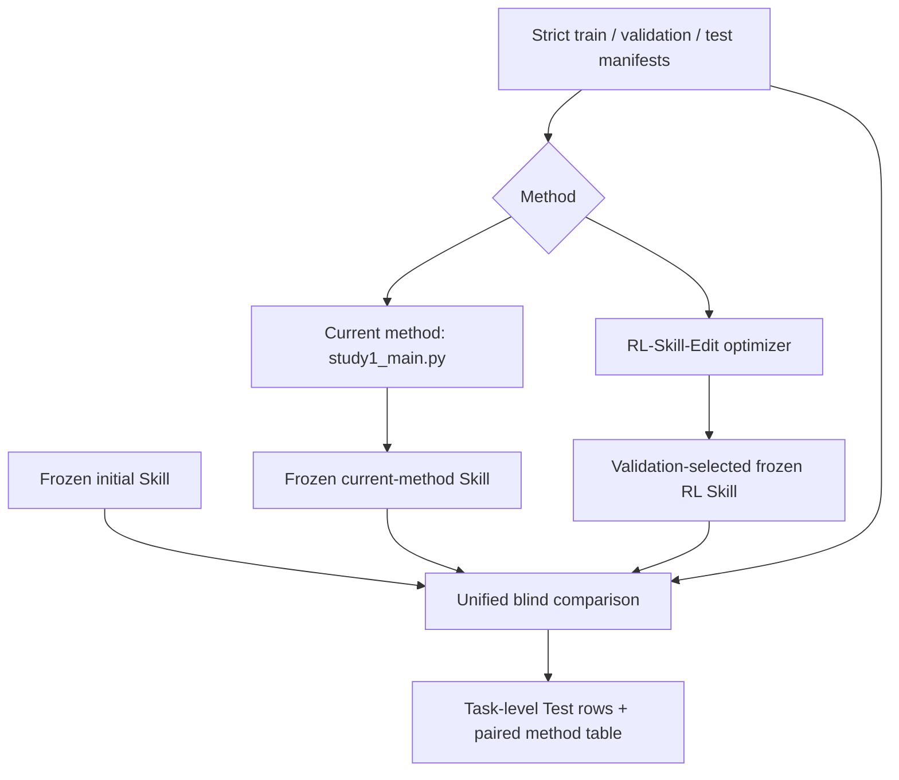

# Architecture

## Two independent optimization paths

The current method remains unchanged as an estimator: `study1_main.py` builds a
teacher-reference target, asks `src/teacher.py` for candidate edits, and gates
them through `src/evaluator.py`. RL-Skill-Edit is a separate adapter-based path;
it never imports the Parser, Teacher, reference rollout, label-space, or lambda
modules.

## RL-Skill-Edit files

| File | Responsibility |
| --- | --- |
| `baselines/rl_skill_edit/types.py` | Immutable Skill, task result, action, patch, transition, and reward records |
| `manifest.py` | Exact-size manifests, ordered IDs, workbook hashes, canonical task fingerprints, and three-way overlap rejection |
| `modules.py` | Markdown section parsing and failure attribution from visible evidence only |
| `action_space.py` | Fixed `max_modules × 8` action index, mask, and reversible decoding |
| `state_encoder.py` | Fixed numeric state containing round, budget, Skill distance, prior action/reward, and padded module diagnostics |
| `policy.py` | One-hidden-layer NumPy actor-critic, masked sampling, value baseline, entropy, gradient clipping, and checkpoint load/save |
| `random_policy.py` | Uniform valid-action policy used only for the random-search sanity check |
| `patch_generator.py` | Strict JSON Editor request, train-only evidence boundary, request hashing, cache, and API-free smoke generator |
| `patch_validator.py` | Target/operator checks, operator semantics, one unambiguous local replacement, protected regions, and size limits |
| `reward.py` | Ordered task-paired reward delta and exact token edit/length/invalid costs |
| `cache.py` | Namespaced atomic JSON cache for rollout and Editor requests |
| `budget.py` | Atomic preflight reservations and role-separated rollout, call, token, cache, and time counters |
| `evaluation.py` | Repository Student adapter, deterministic mock evaluator, cache protocol, blind mode, and pre-freeze Test guard |
| `optimizer.py` | Initial-skill episode resets, paired train transitions, actor-critic updates, Validation selection, snapshots, and audit logs |
| `comparison.py` | Current-method artifact import, formal frozen Test pass, paired bootstrap statistics, and CSV/JSON reports |
| `experiments/run_skill_optimization_comparison.py` | CLI composition, runtime selection, method freezing, common metrics, and final comparison |

## Call sequence

1. The runner loads and validates all three manifests, but passes only Train and
   Validation objects into an optimizer.
2. Each RL episode starts from the exact same initial `SkillArtifact`.
3. For every step, `evaluation.py` evaluates the incumbent on one ordered Train
   mini-batch. `modules.py` and `state_encoder.py` construct the policy state.
4. `policy.py` selects one valid module/operator pair. `STOP` ends the episode.
5. `patch_generator.py` receives only Train evidence and returns one JSON patch.
   `patch_validator.py` applies it locally or rejects it.
6. The candidate is evaluated on the same ordered Train mini-batch, repetition
   count, and seed. `reward.py` computes the paired transition reward.
7. Validation may replace the best checkpoint, but its score is never used in a
   transition or policy update.
8. Only after all requested methods are frozen does the runner load and
   cross-check the Test manifest. The comparison evaluator runs common
   Train/Validation reporting and then calls `freeze()`. Each method, including
   the initial Skill, receives one fresh blind Test bundle with cache reads off.

## Key design decisions

- The policy is local NumPy rather than PyTorch or a large RL framework because
  the repository had no tensor dependency and the policy is a small masked MLP.
- A pure RL run has no code path to Teacher, Reference, Parser, target projection,
  or lambda values; the runner also asserts zero Teacher and Reference counters.
- Cache state is checked before budget reservation. A cache hit still counts
  toward the logical rollout/call budget, so a warm-cache rerun cannot perform
  more search than a cold run; separate cached/executed columns show that it
  incurred no new API tokens, cost, or elapsed model time. Keys include Skill,
  ordered task content/file hashes, split, seed, repetitions, blind protocol, and
  model/evaluator settings.
- Budget reservations happen before complete evaluation bundles or Editor calls;
  exceeding a limit fails before partial work.
- Test data is absent from the optimizer interface. Formal Test calls require
  evaluator freeze, use a blind Student prompt, disable golden-score retry
  feedback, hide target sheet/range metadata, and bypass cache reads.
- The frozen current method is imported rather than reimplemented. Its historical
  resource usage is retained, but its Test reward is always recomputed by the
  common evaluator.
- A `--test-only` run verifies the frozen Skill, initial Skill, config,
  implementation files, dependency lock, optimization summary, seed, and all
  split digests before evaluation. Imported current-method Skill/history/JSONL
  hashes are recorded separately because the legacy archive has no final-Skill
  digest that could prove their historical binding.
- Invalid Editor output has no repair or fallback patch. It leaves the Skill
  unchanged and receives the configured invalid-action penalty.

## Existing files modified

| File | Change |
| --- | --- |
| `src/client.py` | Threads the run seed into supported chat requests |
| `src/agent.py` | Adds explicit switches to hide answer metadata and verifier retry feedback, and threads deterministic per-step seeds |
| `src/evaluator.py` | Threads blind switches and deterministic per-task/repetition seeds through Student evaluation |
| `src/opd_teacher_signal.py`, `src/exskill_signal.py`, `src/label_space.py`, `src/teacher.py` | Preserve the repository's B4 grading and legacy public call contracts exercised by the existing suite |
| `study1_main.py` | Replaces silent Final overlap filtering with a hard error, uses blind Final rollouts, and keeps B3/B4 wiring explicit |
| `README.md` | Documents the RL baseline, commands, artifacts, dependencies, and search record |

The real and mock parameters live in `configs/rl_skill_edit.yaml` and
`configs/rl_skill_edit_smoke.yaml`. Runtime output belongs under the configured
`paths.output_dir`; no module reads a result from Test to alter a Skill or policy.
