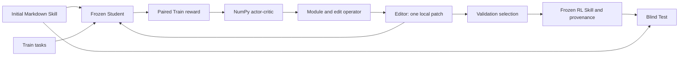

# Architecture

## One RL workflow

The Student and Editor model weights stay frozen. Only the external Markdown
Skill and the small actor-critic parameters change during Train. Validation
selects a checkpoint; Test is loaded only after the selected Skill and its
provenance are frozen.

The repository has one optimizer. The initial Skill is immutable input and a
paired reporting baseline, not a second optimization method.

## File responsibilities

| File | Responsibility |
| --- | --- |
| `rl_skill_edit/cli.py` | Validates one configuration, enforces split isolation, runs train or `--test-only`, binds provenance, and publishes one complete output tree |
| `rl_skill_edit/optimizer.py` | Restarts each episode from the initial Skill, updates the policy from Train reward, and selects the best Validation checkpoint |
| `rl_skill_edit/policy.py` | NumPy actor-critic sampling, value estimates, and updates |
| `rl_skill_edit/action_space.py` | Masks valid Markdown module/operator actions |
| `rl_skill_edit/patch_generator.py` | Requests one structured Editor patch |
| `rl_skill_edit/patch_validator.py` | Enforces one bounded, exact local replacement |
| `rl_skill_edit/evaluation.py` | Ordered mock and Spreadsheet evaluation bundles |
| `rl_skill_edit/adapters/openrouter.py` | Frozen Student and Editor chat calls with token and cost accounting |
| `rl_skill_edit/adapters/spreadsheet.py` | Forced-Skill prompts, copied-workbook execution, and exact range scoring |
| `rl_skill_edit/manifest.py` | Split sizes, unique IDs, file/content hashes, and overlap rejection |
| `rl_skill_edit/budget.py` | Atomic reservations for calls, rollouts, tokens, cache use, and time |
| `rl_skill_edit/reporting.py` | Fresh paired blind Test report for the initial and frozen RL Skills |
| `data/initial_skill.md` | Neutral repository-authored starting Skill without learned edits |

## Execution boundary

1. Preflight validates the configuration, initial Skill, Train and Validation
   manifests, implementation, dependency file, and output separation. Test
   content is not opened.
2. The policy learns from paired Train reward. Validation is read-only and only
   selects the saved checkpoint.
3. The selected Skill and strict provenance are frozen before the sole Test
   loader opens the Test manifest and workbooks.
4. Initial and RL Skills receive the same blind Test order, seeds, repetitions,
   and cache-disabled protocol.
5. The method bundle, reports, cache, manifest, and ownership marker are staged
   and installed as one verified tree. A verified prior tree is retained at the
   deterministic `.previous` path; failed publication restores it.

The real settings are in `configs/rl_skill_edit.yaml`. The deterministic
API-free settings are in `configs/rl_skill_edit_smoke.yaml`.
