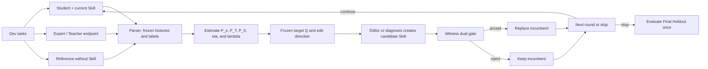

# RL-Skill-Edit — Frozen External Skill Optimization

This repository contains the RL-Skill-Edit baseline together with the OSD runtime
components it reuses. Model weights remain frozen: the system changes only the
external `SKILL.md` and uses independent Train, Validation, and Test data to
optimize and compare the resulting skill.

## What This Project Does

Traditional knowledge distillation usually updates model parameters. OSD instead optimizes the skill document that a model reads before executing a task:

- The Student solves spreadsheet tasks with the current Skill.
- A stronger model and a no-skill Reference provide two behavioral endpoints.
- The Parser converts the Skill into observable histories, behavior labels, and pooling groups.
- Rollouts are used to estimate a reward-calibrated λ and construct the next behavioral target.
- The Editor produces scoped edits to the main Skill text, while diagnosis notes may produce appendix edits.
- In the default `full` mode, a candidate must pass both the behavioral-target gate and the task-reward gate.

The framework uses only API responses, visible execution records, and task scores. It does not require access to model logits.

## Core Workflow



### 1. Freeze the Measurement Structure

At the beginning of each round, the Parser defines:

- **Skill history:** a specific executable step or rule that can be located in the Skill;
- **`Z(h)`:** the mutually exclusive behavior labels available at history `h`;
- **`g(h)`:** the history group whose members share one λ;
- **`parent(z)`:** the Skill location that the Editor may modify for label `z`.

The Student, Teacher endpoint, Reference, and all candidates reuse this measurement structure throughout the round.

### 2. Estimate the Three Distributions and Calibrate Reward

| Distribution | Source in the current implementation |
| --- | --- |
| `P_s(z ∣ h)` | Student rollouts with the current Skill |
| `P_T(z ∣ h)` | No-skill rollouts from `expert.model` |
| `P_0(z ∣ h)` | No-skill Reference rollouts from the Student model |

Reference outcomes are used to estimate `eta(h,z) = E[Y ∣ h,z]` and define the success-weighted target:

```text
P_+(z | h) ∝ P_0(z | h) · eta(h, z)
r_T(h, z) = log P_T(z | h) - log P_0(z | h)
q_ℓ(z | h) ∝ P_0(z | h) · exp(ℓ · r_T(h, z))
```

The current `config.yaml` sets `use_exact_lambda: true`. Within each group, the implementation pools multiple histories, computes the exact one-dimensional information projection from `P_+` onto `q_ℓ`, and then applies cross-group empirical Bayes shrinkage with `s_g² = 1/N_g`. Setting this option to `false` selects the local WLS approximation.

The shrunk `λ_g` defines the final target `Q`. The quantity `log(Q/P_s)` indicates which behaviors should be strengthened and which should be reduced.

An `execution_edit` is generated by the Editor and constrained by `parent(z)`. An `appendix_edit` may be created directly from diagnosis notes. Candidates of both types undergo fresh rollouts before entering the gate.

### 3. Apply the Witness Dual Gate

In the default `full` mode, the incumbent and candidate are each evaluated `B_W` times per Witness task, using the same task order. The main pipeline uses a task-paired point estimate.

A candidate is accepted only if all three conditions hold:

1. The true label-KL decrease against the frozen target is greater than 0.
2. The paired mixed-reward delta is at least `-reward_epsilon`.
3. The candidate's Witness score is no lower than the best score observed so far.

If multiple candidates pass, the implementation selects the candidate with the largest label-KL decrease. After optimization stops, the final frozen Skill is evaluated once on the Final Holdout.

## LLM Roles

All models can be replaced in `config.yaml`. The current defaults are:

| Role | Default model | Responsibility |
| --- | --- | --- |
| Student | `anthropic/claude-3-haiku` | Executes tasks with the current Skill or as the no-skill Reference |
| Teacher | `anthropic/claude-sonnet-4.5` | Failure diagnosis, B4 grading, and proposal context |
| Expert / Teacher endpoint | `anthropic/claude-opus-4.5` | Produces the no-skill endpoint rollouts used to estimate `P_T` |
| Parser | `anthropic/claude-opus-4.5` | Defines histories, groups, labels, and `parent(z)`, then maps rollout steps |
| Editor | `anthropic/claude-opus-4.5` | Generates scoped Skill edits from the frozen target |

`src/teacher.py` coordinates calls for the Teacher, Expert, Editor, and slow-update routines, while each role reads its own configuration.

## Data Splits

| Split | Purpose | Configured cap |
| --- | --- | ---: |
| Dev | Student, Teacher, and Reference rollouts, target estimation, and candidate generation | 60 |
| Witness | Candidate dual gating and running-best tracking | 20 |
| Final Holdout | One-time evaluation of the final Skill | 20 |

`study1_main.py` loads the three formal splits from the configuration, verifies that Dev and Witness do not overlap, and keeps the Final Holdout isolated from both.

## Repository Structure

```text
RL-Skill-Edit/
├── baselines/rl_skill_edit/     # Reward-only RL external-skill optimizer
├── configs/
│   ├── rl_skill_edit.yaml       # Paper experiment configuration
│   └── rl_skill_edit_smoke.yaml # API-free verification configuration
├── config.yaml                  # Global configuration
├── data/
│   └── spreadsheet/
│       └── SKILL.md             # Example Skill
├── study1_main.py               # Complete online optimization loop
├── experiments/
│   └── run_skill_optimization_comparison.py
│                                  # Unified frozen-skill comparison runner
├── src/
│   ├── agent.py                 # Rollouts, code execution, and Excel scoring
│   ├── client.py                # OpenRouter client and cost tracking
│   ├── parser_llm.py            # Measurement structure and step mapping
│   ├── label_space.py           # Core P/eta/lambda/EB/Q/KL estimation
│   ├── teacher.py               # Teacher, Expert, and Editor services
│   ├── evaluator.py             # Witness evaluation and dual gate
│   ├── skill_library.py         # Skill parsing, persistence, and scoped edits
│   ├── validator.py             # Static candidate safety checks
│   ├── logger.py                # JSONL logs, text logs, and prompt snapshots
│   ├── reference_baseline.py    # Optional no-skill reward cache
│   ├── exskill_signal.py        # Auxiliary residual signals retained for compatibility
│   ├── opd_teacher_signal.py    # B4 grading data structures
│   └── library_registry.py      # Final Library registry
├── tests/                       # Tests
├── results/                     # Experiment results, generated at runtime
└── logs/                        # Structured logs and prompt snapshots
```

## Setup

### 1. Clone the Repository

```bash
git clone git@github.com:huangchenyi2002/RL-Skill-Edit.git
cd RL-Skill-Edit
```

### 2. Create a Local Environment

The pinned RL environment requires Python 3.12 or newer:

```bash
python3 -m venv .venv

# macOS / Linux
source .venv/bin/activate

# Windows PowerShell
# .venv\Scripts\Activate.ps1

python -m pip install openai httpx python-dotenv PyYAML numpy scipy tqdm jsonschema openpyxl pandas pytest
```

For the RL baseline in this workspace, install the recorded environment from the
repository root:

```bash
.venv/bin/python -m pip install -r requirements-rl.txt
```

The spreadsheet-execution subprocess resolves `python` from `PATH`, so activate the same virtual environment before running an experiment.

### 3. Configure OpenRouter

Create a `.env` file in the repository root:

```dotenv
OPENROUTER_API_KEY=sk-or-v1-...

# Optional
OPENROUTER_SITE_URL=http://localhost
OPENROUTER_APP_NAME=OSD-Experiment
```

A proxy can also be configured through `HTTPS_PROXY`, `HTTP_PROXY`, `ALL_PROXY`, or `openrouter.proxy`.

> Do not commit a `.env` file that contains an API key.

### 4. Prepare the Skill and Data

To use the example Skill in this repository, set the following path in `config.yaml`:

```yaml
paths:
  skill_file: "data/spreadsheet/SKILL.md"
```

Prepare and configure the following input paths:

```text
data/spreadsheetbench/splits/dev_pool.json
data/spreadsheetbench/splits/witness.json
data/spreadsheetbench/splits/test.json
data/spreadsheetbench/splits/literacy_probe.json
```

Each SpreadsheetBench task requires at least the following fields, and both workbook files must exist:

```json
{
  "task_id": "unique-task-id",
  "description": "Task instruction",
  "spreadsheet": {
    "init_file": "/absolute/path/input.xlsx",
    "golden_file": "/absolute/path/golden.xlsx",
    "answer_sheet": "Sheet1",
    "answer_position": "A1:C10"
  }
}
```

`study1_main.py` also reads `literacy_probe.json` at startup. This file must contain valid JSON.

> Security note: `src/agent.py` executes model-generated Python in a local subprocess. A temporary workbook, timeout, and deny list do not provide full isolation. Run experiments in an isolated environment without sensitive data.

## Run Study 1

Run all commands from the repository root with the virtual environment activated:

```bash
python study1_main.py --config config.yaml

# Optional overrides
python study1_main.py --config config.yaml --beta_mode b4
python study1_main.py --config config.yaml --ablation execution_only
python study1_main.py --config config.yaml --ablation no_gate
```

The `no_gate` ablation skips candidate-level Witness gating and selects the first candidate that passes static validation.

## Outputs

| Path | Contents |
| --- | --- |
| `logs/study1_<timestamp>.jsonl` | Structured event stream |
| `logs/study1_<timestamp>.log` | Human-readable summary |
| `logs/study1_<timestamp>/prompts/` | Prompts, responses, and Skill snapshots |
| `results/study1/K_final_<timestamp>/` | Final Library |
| `results/study1/study1_history_<timestamp>.json` | Complete experiment history |
| `results/best_library.json` | Registry of final Library paths and metrics |

## Key Configuration

| Option | Current value | Meaning |
| --- | ---: | --- |
| `data.dev_pool_size` | 60 | Dev cap |
| `data.witness_size` | 20 | Witness cap |
| `data.final_holdout_size` | 20 | Final Holdout cap |
| `study1.N_max` | 12 | Maximum number of rounds |
| `study1.S_max` | 6 | Maximum consecutive stalls |
| `study1.B_W` | 3 | Repetitions per Witness task |
| `study1.use_exact_lambda` | `true` | Exact pooled information projection |
| `study1.lambda_neutral` | 0.0 | Neutral value when evidence is insufficient |
| `study1.gate_metric` | `mixed` | Blend of hard and soft reward |
| `study1.reward_epsilon` | 0.001 | Maximum point-estimate reward regression allowed by the gate |
| `study1.enable_slow_update` | `false` | Disables slow updates by default |

See `config.yaml` for the full configuration.

## RL-Skill-Edit Baseline

`RL-Skill-Edit` is independent of the teacher-reference estimator. The frozen
Student remains unchanged; a small NumPy actor-critic learns only which pair
`(Markdown module, edit operator)` to select. The eight operators are add,
rewrite, delete, merge, reorder, example edits, and `STOP`. The configured Editor
then returns one strict JSON patch, and the validator either applies exactly one
local replacement or records an invalid action.

The transition reward is the paired mean score change on one ordered train
mini-batch, minus skill-length, token-edit-distance, and invalid-action penalties.
Every episode restarts from the same initial Skill. Train rewards update the
policy, Validation selects the frozen checkpoint, and Test is unavailable through
the optimizer interface. Formal Test evaluation begins only after every compared
Skill hash is frozen; it reruns the initial Skill and all final methods with the
same ordered tasks, Student settings, repetitions, seed, blind prompt, and no
cache reads.

Before training, the CLI rejects any overlap between protected inputs and the
final or retained-previous output paths without opening the Test manifest.
After Validation freezes the Skill, the sole Test loader resolves its workbook
paths and a second audit runs before publication. Published trees carry
`.rl-skill-edit-output.json`, an exact ownership marker bound to the lexical
final output path; an unowned or incomplete `.<output-name>.previous` tree is
rejected and never deleted.

The default real configuration mirrors the observed 2026-07-14 run closely: 12
episodes, at most 2 edits per episode, 26 train tasks per step, 3 Validation
repetitions, at most 25 Editor calls, and no Teacher or Reference calls. The
checkout does not include the proprietary SpreadsheetBench workbook splits, so
the three manifest paths in `configs/rl_skill_edit.yaml` must exist before a real
run.

### Run the API-free smoke experiment

```bash
bash scripts/run_rl_skill_edit_smoke.sh
```

This runs actual policy sampling and updates, structured patch validation,
checkpoint selection, freezing, fresh initial/current/RL Test evaluation, and
paired statistics without an API key. Its checked output is written to
`results/rl_skill_edit_smoke/`.

### Train RL-Skill-Edit on the real task splits

After supplying the three private SpreadsheetBench manifests referenced by
`configs/rl_skill_edit.yaml`, train and compare the initial and RL-edited Skills:

```bash
.venv/bin/python experiments/run_skill_optimization_comparison.py \
  --config configs/rl_skill_edit.yaml \
  --methods initial_skill rl_skill_edit \
  --seed 42
```

To include `current_method`, first update `paths.current_skill`,
`paths.current_history`, and `paths.current_jsonl` to point to the archived
method artifacts; those files are not public data and are not included here.
Then add `current_method` to `--methods`. It imports the frozen Skill plus its
history/JSONL resource counters and reruns that Skill under the unified
evaluation protocol. It does not reuse the old aggregate Test score. Pure
`rl_skill_edit` hard-checks that
Teacher and Reference rollout counters remain zero. Optimization usage and the
common reporting pass are shown separately. The archived current-method run did
not store phase-level token/cost counters, so its token/cost total still includes
its old Final pass; the comparison row marks this scope explicitly.

Persistent caches avoid repeated API charges. Cached evaluations and Editor
responses still consume the same logical rollout/call budget as cold calls, so a
warm-cache rerun cannot search more candidates; the comparison CSV separates
cached from newly executed work, while tokens and cost record only new calls.

The random-search sanity check uses the same optimizer, Editor, task bundles, and
budget, but replaces the learned policy with a uniform valid-action policy:

```bash
.venv/bin/python experiments/run_skill_optimization_comparison.py \
  --config configs/rl_skill_edit.yaml \
  --methods initial_skill rl_skill_edit random_edit_search \
  --seed 42
```

To rerun only the common frozen-skill evaluation after training:

```bash
.venv/bin/python experiments/run_skill_optimization_comparison.py \
  --config configs/rl_skill_edit.yaml \
  --methods initial_skill rl_skill_edit \
  --seed 42 --test-only
```

The main artifacts are:

| Path | Contents |
| --- | --- |
| `rl_skill_edit/best_rl_skill.md` | Validation-selected frozen RL Skill |
| `rl_skill_edit/final_rl_policy.pt` | NumPy actor-critic weights, config, and RNG state |
| `rl_skill_edit/rl_training_log.jsonl` | Per-step action, probability, value, patch, paired task rewards, penalties, and budget |
| `rl_skill_edit/rl_episode_summary.csv` | Episode returns, policy losses, and checkpoint paths |
| `rl_skill_edit/freeze_provenance.json` | Frozen Skill, initial Skill, config, implementation, dependencies, optimization summary, seed, and split digests required by `--test-only` |
| `.rl-skill-edit-output.json` | Exact output ownership marker bound to the lexical final output path |
| `test_task_level_results.csv` | Raw aligned Test rewards for every method and task |
| `method_comparison.csv` | Train/Validation/Test means, paired CI, win/tie/loss, Skill size, edits, and separate optimization/reporting/total resource columns |
| `experiment_manifest.json` | Config/code/dependency hashes, split digests, ordered IDs, seed, frozen Skill hashes, and imported current-artifact hashes |

Implementation details and the leakage fixes are recorded in
`docs/rl_skill_edit_implementation_note.md` and `ARCHITECTURE.md`.

## Testing

After installing the dependencies, run the tracked tests with:

```bash
.venv/bin/python -B -m pytest -p no:cacheprovider tests
.venv/bin/ruff check baselines/rl_skill_edit \
  experiments/run_skill_optimization_comparison.py \
  src/client.py tests/test_*rl_skill_edit*.py \
  tests/test_budget_accounting.py tests/test_client_usage_accounting.py \
  tests/test_data_split_isolation.py tests/test_blind_final_evaluation.py \
  tests/test_skill_optimization_comparison.py
```

The API-free end-to-end test is `tests/test_rl_skill_edit_end_to_end.py`.
Real-run repeatability additionally requires an API provider that honors the
request seed; the mock runtime is fully deterministic.

## Search Record

- 2026-07-13: This README rewrite used only the current `main` branch, Git history, and repository code. It introduced no external template or additional dependency, so no additional search on skills.sh or GitHub was performed.
- 2026-07-15: For the RL baseline, we reviewed [TextGrad](https://github.com/zou-group/textgrad), [PromptWizard](https://github.com/microsoft/PromptWizard), [Llama Prompt Ops](https://github.com/meta-llama/llama-prompt-ops), [EvoAgentX](https://github.com/EvoAgentX/EvoAgentX), and the [skills.sh prompt-engineering entry](https://www.skills.sh/jamesrochabrun/skills/openai-prompt-engineer). They are useful related implementations, but none matches the required masked module/operator MDP and strict repository budget/leakage boundary. The baseline therefore uses a small local NumPy actor-critic and adds no large RL framework.
